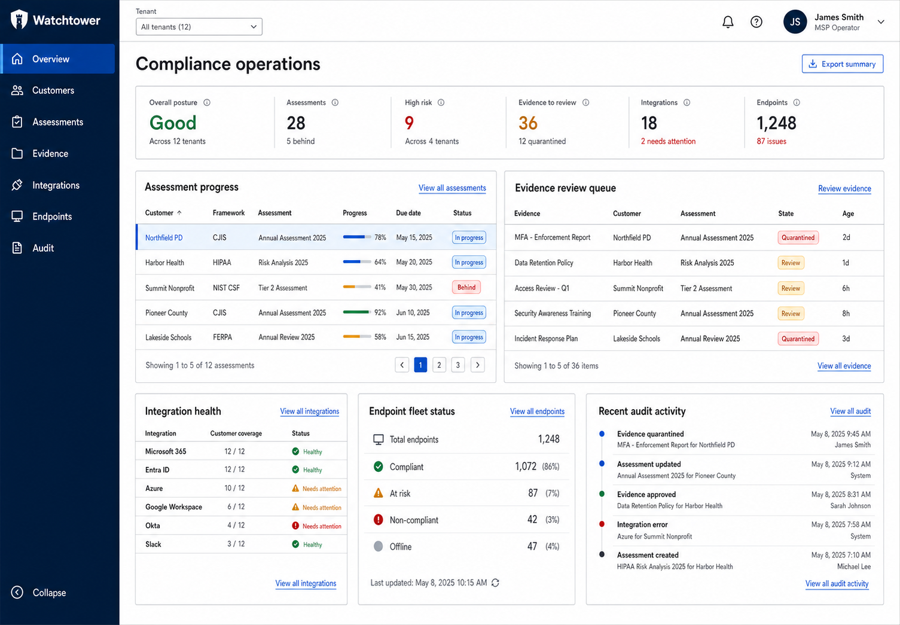

# Watchtower GRC

[](https://github.com/guiltykeyboard/msp-vciso/actions/workflows/lint.yml)
[](https://github.com/guiltykeyboard/msp-vciso/actions/workflows/api.yml)
[](https://github.com/guiltykeyboard/msp-vciso/actions/workflows/frameworks.yml)
[](https://github.com/guiltykeyboard/msp-vciso/actions/workflows/repository-metadata.yml)
[](https://github.com/guiltykeyboard/msp-vciso/actions/workflows/api-docs.yml)


Watchtower is an open-source, self-hosted compliance and evidence platform for managed service providers and the customers they support across commercial, nonprofit, and public-sector environments. It is MSP-first and framework-neutral. CJIS Security Policy 6.1 and Ohio Revised Code 9.64 are initial reference packs that prove the platform can accommodate law enforcement and other uncommon requirements without making them the product boundary.

> Project status: product and data-model foundation. This repository is not yet an audit-ready product and does not provide legal advice or certify compliance.

## Dashboard preview

[](docs/design/msp-dashboard-concept.png)

The dashboard is designed as an MSP operations workspace: tenant-scoped compliance posture, evidence health, integration status, endpoint coverage, and audit activity are visible from one responsive control plane. The image above is the current product concept; the implemented React dashboard follows this direction while live features continue to mature.

## Development stack

The executable vertical slice includes a FastAPI service, PostgreSQL migrations, forced row-level security, tenant-scoped assessment endpoints, immutable evidence provenance, append-only human reviews and audit events, and negative cross-tenant tests.

Start PostgreSQL, apply migrations, and wait for the API health check:

```bash
docker compose up --build --wait db migrate api
```

The OpenAPI interface is then available at `http://localhost:8000/docs`. Run the API and database isolation suite with:

```bash
docker compose --profile test run --rm api-tests
```

The local API uses explicit `X-Watchtower-Organization` and `X-Watchtower-Actor` headers only when `WATCHTOWER_ALLOW_INSECURE_DEV_AUTH=true`. This adapter is for development and automated tests; application startup rejects it in the production environment. A production OIDC identity adapter is a required security gate before real customer data is used.

## Why this exists

Most compliance automation products are priced and designed for venture-backed SaaS companies. A township, village, dispatch center, or police department often cannot justify a five-figure annual platform before paying for the actual remediation work.

Watchtower is designed around a different operating model:

- One MSP workspace can serve many legally separate customer tenants.
- Frameworks are versioned data packs, so common baselines and uncommon sector, contractual, state, or local requirements use the same product model.
- Evidence includes provenance, collection time, collector version, scope, hash, reviewer decision, and expiration—not merely an uploaded file.
- Automated checks are deterministic. AI can draft, map, explain, and summarize, but cannot silently declare a control compliant.
- Self-hosting is a first-class deployment mode; a managed hosting service can use the same open-source code.

## Product direction

The recommended path is not a wholesale rewrite of Vanta or Comp AI. It is an MSP compliance control plane that can integrate with existing sources such as Microsoft 365, Entra ID, endpoint management, backup platforms, vulnerability scanners, Prowler, and a small cross-platform device collector. Sector-specific workflows are installable capabilities on top of that general foundation.

The first useful release should support:

1. MSP and customer organizations with explicit tenant-scoped roles.
2. Versioned framework packs and cross-framework control mapping.
3. Assessments, applicability decisions, implementation narratives, findings, and remediation work.
4. Manual and automated evidence with immutable provenance and reviewer approval.
5. Configurable obligations, deadlines, and sensitive-evidence handling, initially demonstrated by Ohio incident reporting and CJIS.
6. Auditor/customer read-only access and a redacted evidence export.

See [the product decision](docs/product-decision.md), [the architecture](docs/design.md), [evidence object storage](docs/object-storage.md), [the integration roadmap](docs/integrations.md), [the endpoint collector design](docs/endpoint-collector.md), [framework authoring](docs/framework-authoring.md), and [the upstream source/reuse policy](docs/upstream-projects.md).

The development stack now includes the React MSP operations dashboard at `http://localhost:5173`. It reads tenant-scoped assessment, evidence, integration, endpoint, and audit data from the API. The current identity form is deliberately labeled as development-only until the production OIDC adapter is implemented.

## API reference

The application publishes interactive Swagger UI at `/docs`, ReDoc at `/redoc`, and its OpenAPI JSON at `/openapi.json`. Deterministic snapshots are committed as [OpenAPI JSON](api/openapi.json), a [Postman collection](api/postman/watchtower.postman_collection.json), and a [Swagger-style static reference](api/reference/index.html). The reference is published through GitHub Pages at [guiltykeyboard.github.io/msp-vciso](https://guiltykeyboard.github.io/msp-vciso/). See [API documentation](docs/api.md) for generation and validation commands.

The current machine-readable [CycloneDX SBOM](sbom/watchtower.cdx.json) and its [human-readable guide](SBOM.md) are maintained in the repository. CI regenerates the SBOM and repository-local language/line-count badges and fails if the reviewed files are stale; it never creates an unchecked follow-up commit on `main`. See the [continuous integration trust model](docs/continuous-integration.md).

## Framework packs

Framework content lives in `frameworks/` and is validated independently of the future application runtime.

```text
frameworks/
├── schema/framework-pack.schema.json
└── ohio-hb96/2025.09.30.json
```

Validate all packs with only Python's standard library:

```bash
python3 tools/validate_frameworks.py
```

The initial Ohio pack distinguishes statutory requirements, conditional duties, record classifications, and non-mandatory implementation guidance. That distinction is essential: the platform must not turn a suggested safeguard into a false statement of law.

## Architecture principles

- PostgreSQL row-level security plus application authorization for tenant isolation.
- Tenant identity derived from the authenticated session or enrollment credential, never trusted from an arbitrary request body.
- S3-compatible object storage with per-tenant keys and content hashes for evidence.
- Append-only audit events for security-sensitive actions.
- A queue-backed collector runtime with short-lived, least-privilege credentials.
- A small signed endpoint agent that sends posture facts, not user documents or CJI.
- OSCAL-compatible import/export at the boundary while keeping the authoring format approachable.

## Licensing

The project license is GNU AGPLv3 so self-hosting remains free and hosted modifications remain available to their users. Compatible open-source platforms are intended to serve as both implementation references and, after path-specific license review, sources for integrations or adapted components. Every source import must be traceable through [third-party notices](THIRD_PARTY_NOTICES.md); commercially licensed open-core directories remain excluded without a separate grant.

## Authoritative references

- [FBI CJIS Security Policy v6.1 (June 25, 2026)](https://le.fbi.gov/file-repository/cjis_security_policy_v6-1_20260625.pdf)
- [Ohio Revised Code 9.64](https://codes.ohio.gov/ohio-revised-code/section-9.64)
- [Ohio Auditor of State Bulletin 2025-007](https://www.ohioauditor.gov/publications/bulletins/2025/2025-007.pdf)
